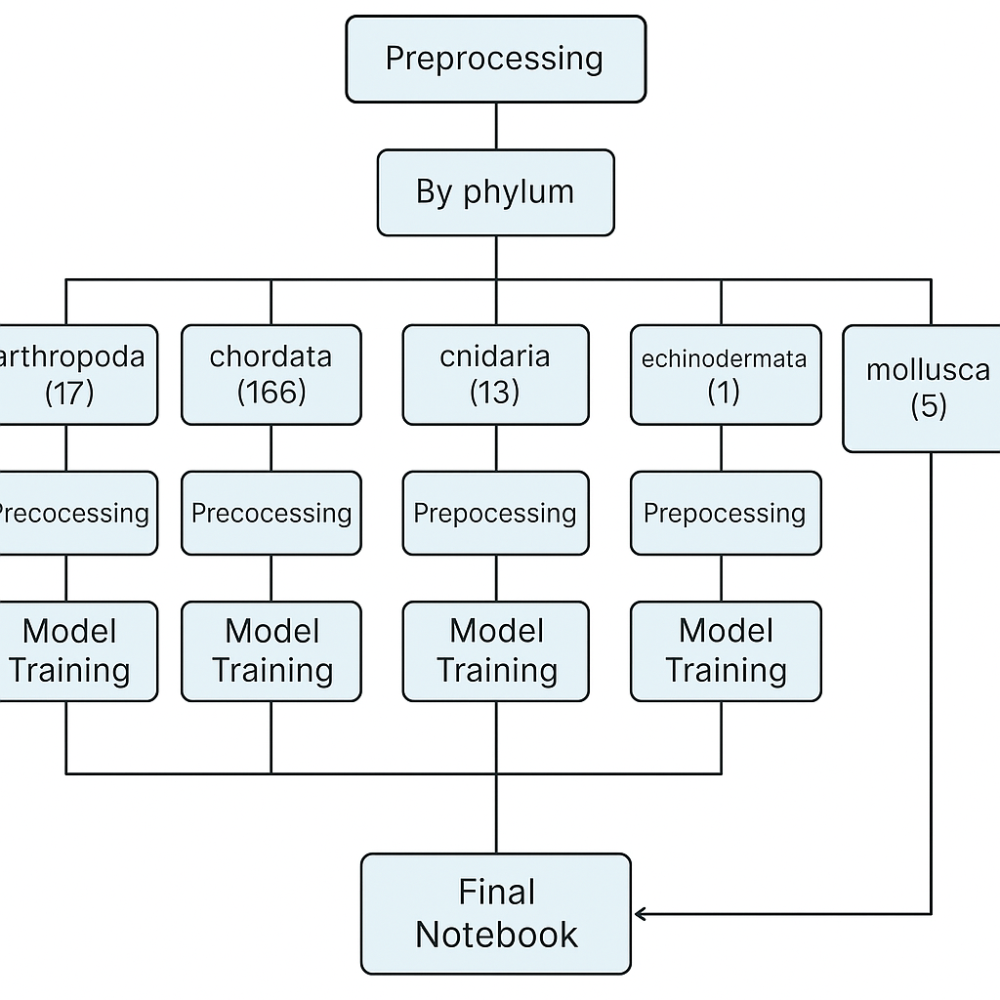

# DeepLearning2425

## **19/03 Class**

### Project Tips

- some images are not in RBG, so we need to transform it - [Image data loading](https://keras.io/api/data_loading/image/)
- using image_dataset_from_directory we can select the image_size (cuz there diff sizes) or explore first the sizes of teh images and then resize - [Image data loading](https://keras.io/api/data_loading/image/)
- look also to this [Image data loading](https://keras.io/api/data_loading/image/) for preprocessing

**using the resizing that keras provided or with the image data loading**

* other problem that we will have *overfitting*: we can try data augmentation [Data augmentation  |  TensorFlow Core](https://www.tensorflow.org/tutorials/images/data_augmentation) or [Image augmentation layers](https://keras.io/api/layers/preprocessing_layers/image_augmentation/)
* we can use random zoom for data augmentation
* change the darkness/brigthness

⚠️exagerating the data augmentation can destroy the patterns that we need for the model to learn

* try to use some [Keras Applications](https://keras.io/api/applications/)  - which provide pre-trained models that can be fine-tuned for your task. Since these models are already trained, update the weights **gradually** to preserve learned features. Additionally, **reduce the learning rate** to avoid overwriting existing knowledge while allowing the model to adapt to your dataset.

### Extra Notes (not directly related with the Project)

* Training a model from scratch can lead to high variability, making it harder to converge effectively.
* Adding more layers can worsen the issue, as **nonlinear transformations** can introduce instability, especially when applied to **initially linear inputs** resulting in a highly nonlinear output.
* One way to address this challenge is by using a  **Residual Neural Network (ResNet)** , which helps maintain stable learning by allowing the model to learn residual mappings rather than full transformations.

## **26/03 Class**

* leaky relu vs relu
* Gated recurrent unit

## **04/02 Class**

⚠️ we can use phylum but we need to justify

* If the gradient becomes too small (vanishing), training may get stuck at a suboptimal point, preventing the model from reaching the global optimum.
* If the gradient is too large (exploding), the model may overshoot and miss the global optimum.
* A drawback of LSTMs is their computational cost, making them potentially expensive to train.
* Pooling operations can be used to reduce the dimensionality of the data.

⚠️We can explore pre-trained models from [Hugging Face](https://huggingface.co/models) for our project.

## Tasks

- Clean/Improve notebook 1. Preprocessindd functions to utils and identify them
- Built a VGG16 model function that can be used/applied in every notebook
- Developed a final notebook and check how should that be contructed like
  - how it does recieve the input?
  - what will be the output? id of the image and the correspondent famiStart the report:
- - introduction
  - structure (split by phylum)
